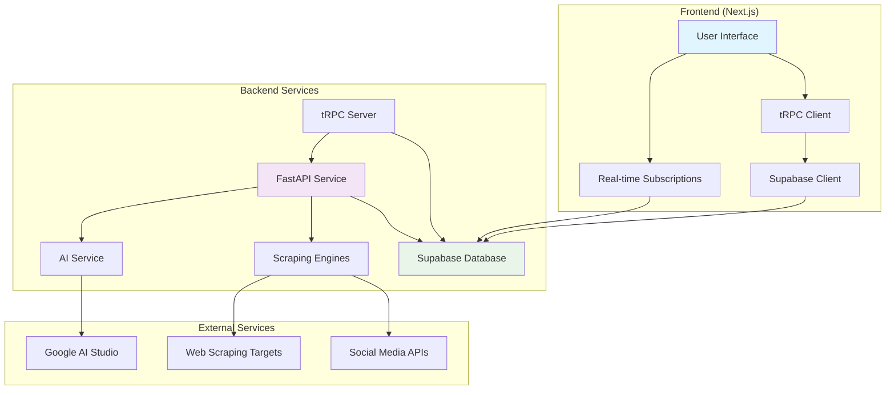

# Design Document

## Overview

launch-lens AI is architected as a modern full-stack SaaS idea validation platform using Next.js 14 with App Router for the frontend, Supabase for authentication and database, and FastAPI with Python for the scraping and AI analysis backend. The system follows a microservices approach where the frontend handles user interactions and data presentation, while the backend manages intensive scraping operations and AI processing asynchronously.

The platform combines automated web scraping from 9 distinct sources (Product Hunt, Reddit, Facebook, Twitter, Instagram, Google Search, Google Play Store, Apple App Store, Microsoft Store) with Google AI Studio's Gemini model to provide comprehensive validation reports. These reports include market opportunity analysis, competitive landscape assessment, user feedback sentiment analysis, and strategic recommendations with calculated market scores.

The architecture prioritizes type safety through tRPC, real-time updates via Supabase subscriptions, and scalable background processing for data collection and analysis. The design ensures data security through Row Level Security (RLS) policies, maintains separation of concerns between user-facing operations and data processing workflows, and provides responsive mobile-optimized user experiences.

## Architecture

### High-Level Architecture



### Data Flow

1. **User Interaction**: User submits validation request through Next.js frontend
2. **Request Processing**: tRPC server creates validation record in Supabase with "processing" status
3. **Background Trigger**: tRPC server triggers FastAPI scraping service asynchronously
4. **Data Collection**: FastAPI orchestrates parallel scraping from 9 sources (Product Hunt, Reddit, Facebook, Twitter, Instagram, Google Search, Google Play Store, Apple App Store, Microsoft Store)
5. **Data Storage**: Scraped competitors and feedback are stored in Supabase with validation relationships
6. **AI Analysis**: Gemini AI processes scraped data to generate comprehensive analysis
7. **Completion**: Validation status updated to "completed" with market score calculation
8. **Real-time Updates**: Frontend receives real-time updates via Supabase subscriptions

## Components and Interfaces

### Frontend Components (Next.js)

#### Authentication Layer
- **AuthProvider**: Context provider managing Supabase Auth state
- **LoginForm/SignupForm**: Authentication forms with validation
- **ProtectedRoute**: HOC ensuring authenticated access

#### Dashboard Components
- **ValidationList**: Displays user's validations with status indicators
- **ValidationCard**: Individual validation summary with market score
- **CreateValidationForm**: Form for submitting new validation requests

#### Results Components
- **ValidationResults**: Main results page orchestrating all analysis sections
- **CompetitorTable**: Sortable table displaying competitor data with filtering
- **FeedbackAnalysis**: Sentiment analysis visualization with positive/negative categorization
- **AIAnalysis**: Structured display of AI-generated insights and recommendations
- **LoadingStates**: Real-time progress indicators during processing

#### UI Components
- **Button/Input/Card**: Reusable Tailwind CSS components
- **ErrorBoundary**: Error handling and user feedback

### Backend Components (FastAPI)

#### Scraping Architecture
- **ScrapingService**: Orchestrates parallel scraping from all sources with error handling for individual scraper failures
- **BaseScraper**: Abstract base class defining scraper interface with standardized data extraction methods
- **Source-Specific Scrapers**: 
  - ProductHuntScraper: Extracts product data and competitor information with user counts and pricing models
  - RedditScraper: Searches relevant subreddits using Reddit API (PRAW) for user discussions and feedback
  - FacebookScraper: Scrapes public groups and pages for user sentiment and discussions
  - TwitterScraper: Extracts tweets and sentiment analysis for market feedback
  - InstagramScraper: Hashtag and content analysis for social media presence
  - GoogleSearchScraper: Search trends and competitor research with market intelligence
  - GooglePlayStoreScraper: Android app data and reviews for mobile market analysis
  - AppStoreScraper: iOS app data and reviews for mobile market analysis
  - MicrosoftStoreScraper: Windows app data and reviews for desktop market analysis

#### AI and Analysis
- **AIService**: Integrates with Google AI Studio Gemini model
- **AnalysisEngine**: Processes scraped data for market scoring
- **SentimentAnalyzer**: Categorizes feedback sentiment

#### Data Management
- **SupabaseService**: Database operations and validation status management
- **DataCleaner**: Deduplication and data quality processing

### API Interfaces

#### tRPC Router Structure
```typescript
// Validation Operations
validationsRouter = {
  create: protectedProcedure,      // Create new validation
  getAll: protectedProcedure,      // Get user's validations
  getById: protectedProcedure,     // Get validation with related data
  updateStatus: protectedProcedure // Update processing status
}

// Authentication
authRouter = {
  getSession: publicProcedure,     // Get current session
  signOut: protectedProcedure      // Sign out user
}
```

#### FastAPI Endpoints
```python
# Scraping Operations
POST /api/scrape              # Trigger validation processing
GET /health                   # Health check endpoint

# Background Tasks
process_validation()          # Async validation processing
calculate_market_score()      # Market score calculation
```

## Data Models

### Database Schema (Supabase/PostgreSQL)

#### Core Tables
```sql
-- User profiles (extends Supabase Auth)
profiles {
  id: UUID (PK, references auth.users)
  first_name: TEXT
  created_at: TIMESTAMP
  updated_at: TIMESTAMP
}

-- Validation requests
validations {
  id: UUID (PK)
  user_id: UUID (FK to auth.users)
  title: TEXT (1-255 chars)
  idea_text: TEXT (10-1000 chars)
  market_score: DECIMAL(3,1)
  status: TEXT ('processing'|'completed'|'failed')
  created_at: TIMESTAMP
  completed_at: TIMESTAMP
  competitor_count: INTEGER
  feedback_count: INTEGER
  sources_scraped: JSONB
}

-- Competitor data
competitors {
  id: UUID (PK)
  validation_id: UUID (FK)
  name: TEXT
  description: TEXT
  website: TEXT
  estimated_users: INTEGER
  estimated_revenue: TEXT
  pricing_model: TEXT
  source: TEXT
  source_url: TEXT
  confidence_score: DECIMAL(3,2)
  created_at: TIMESTAMP
}

-- User feedback
feedback {
  id: UUID (PK)
  validation_id: UUID (FK)
  text: TEXT
  sentiment: TEXT ('positive'|'negative'|'neutral')
  sentiment_score: DECIMAL(3,2)
  source: TEXT
  source_url: TEXT
  author_info: JSONB
  created_at: TIMESTAMP
}

-- AI analysis results
ai_analysis {
  id: UUID (PK)
  validation_id: UUID (FK)
  market_opportunity: TEXT
  competitive_analysis: TEXT
  strategic_recommendations: TEXT
  risk_assessment: TEXT
  gtm_strategy: TEXT
  feature_priorities: TEXT
  executive_summary: TEXT
  created_at: TIMESTAMP
}
```

#### Row Level Security (RLS) Policies
- Users can only access their own validations and related data
- Cascade delete policies ensure data consistency
- Service role key used for backend operations

### TypeScript Interfaces

#### Frontend Types
```typescript
interface Validation {
  id: string;
  userId: string;
  title: string;
  ideaText: string;
  marketScore?: number;
  status: 'processing' | 'completed' | 'failed';
  createdAt: Date;
  completedAt?: Date;
  competitorCount: number;
  feedbackCount: number;
  sourcesScraped: string[];
}

interface Competitor {
  id: string;
  validationId: string;
  name: string;
  description?: string;
  website?: string;
  estimatedUsers?: number;
  estimatedRevenue?: string;
  pricingModel?: string;
  source: string;
  sourceUrl?: string;
  confidenceScore: number;
}

interface ValidationResults {
  validation: Validation;
  competitors: Competitor[];
  feedback: Feedback[];
  aiAnalysis?: AIAnalysis;
}
```

## Performance and Responsive Design

### Responsive Design Strategy
- **Mobile-First Approach**: Design components with mobile devices as the primary target, then enhance for larger screens
- **Tailwind CSS Breakpoints**: Utilize responsive utilities (sm:, md:, lg:, xl:) for adaptive layouts
- **Touch-Friendly Interfaces**: Ensure buttons and interactive elements meet minimum touch target sizes (44px)
- **Flexible Grid Systems**: Use CSS Grid and Flexbox for layouts that adapt to different screen sizes
- **Progressive Enhancement**: Core functionality works on all devices, with enhanced features for capable devices

### Performance Optimization
- **Loading States**: Implement skeleton screens and progress indicators during data fetching
- **Real-time Updates**: Use Supabase subscriptions to provide live status updates without polling
- **Code Splitting**: Leverage Next.js automatic code splitting for faster initial page loads
- **Image Optimization**: Use Next.js Image component for optimized image delivery
- **Caching Strategy**: Implement appropriate caching for static content and API responses

### User Experience Requirements
- **3-Second Load Time**: Cached content and critical paths load within 3 seconds
- **Offline Graceful Degradation**: Display cached data and appropriate messaging when offline
- **Consistent Cross-Device Experience**: Maintain design consistency across mobile, tablet, and desktop
- **Accessibility Compliance**: Follow WCAG 2.1 guidelines for inclusive design

## Error Handling

### Frontend Error Handling
- **React Error Boundaries**: Catch and display component errors gracefully
- **tRPC Error Handling**: Type-safe error responses with user-friendly messages
- **Form Validation**: Real-time validation with Zod schemas
- **Network Errors**: Retry mechanisms and offline state handling
- **Loading States**: Skeleton screens and progress indicators

### Backend Error Handling
- **Scraping Failures**: Continue processing other sources when individual scrapers fail
- **Rate Limiting**: Respect API limits and implement exponential backoff
- **AI Service Errors**: Fallback to basic analysis when Gemini API fails
- **Database Errors**: Transaction rollback and data consistency checks
- **Validation Status**: Update to "failed" status with error logging

### Error Recovery Strategies
- **Partial Success**: Display available data even if some sources fail
- **Retry Mechanisms**: Allow users to retry failed validations
- **Graceful Degradation**: Core functionality works even with service failures
- **User Feedback**: Clear error messages with actionable next steps

## Testing Strategy

### Frontend Testing
- **Unit Tests**: Jest and React Testing Library for components
- **Integration Tests**: tRPC client-server integration
- **E2E Tests**: Playwright for critical user flows
- **Visual Regression**: Screenshot testing for UI consistency

### Backend Testing
- **Unit Tests**: pytest for individual scraper and service functions
- **Integration Tests**: FastAPI test client for endpoint testing
- **Mock Testing**: Mock external APIs and services
- **Load Testing**: Concurrent scraping performance validation

### Test Coverage Requirements
- **Frontend**: 80% coverage for components and utilities
- **Backend**: 90% coverage for business logic and scrapers
- **Critical Paths**: 100% coverage for authentication and data processing

### Testing Data
- **Mock Scraped Data**: Realistic test datasets for each source
- **AI Response Mocks**: Consistent Gemini API responses for testing
- **Database Fixtures**: Test data for various validation scenarios
- **Error Scenarios**: Comprehensive failure mode testing

### Continuous Integration
- **GitHub Actions**: Automated testing on pull requests
- **Type Checking**: TypeScript and Python type validation
- **Linting**: ESLint, Prettier, and Black code formatting
- **Security Scanning**: Dependency vulnerability checks