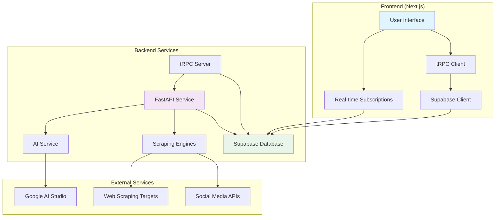

# Design Document - launch-lens AI Validation Platform

## Overview

launch-lens AI is architected as a modern full-stack SaaS idea validation platform using Next.js 14 with App Router for the frontend, Supabase for authentication and database, and FastAPI with Python for the scraping and AI analysis backend. The system follows a microservices approach where the frontend handles user interactions and data presentation, while the backend manages intensive scraping operations and AI processing asynchronously.

The platform combines automated web scraping from multiple distinct sources (Product Hunt, Reddit, Facebook, Twitter, Instagram, Google Search, Google Play Store, Apple App Store, Microsoft Store) with Google AI Studio's Gemini model to provide comprehensive validation reports. These reports include market opportunity analysis, competitive landscape assessment, user feedback sentiment analysis, and strategic recommendations with calculated market scores (1-10 scale).

The architecture prioritizes type safety through tRPC, real-time updates via Supabase subscriptions, and scalable background processing for data collection and analysis. The design ensures data security through Row Level Security (RLS) policies, maintains separation of concerns between user-facing operations and data processing workflows, and provides responsive mobile-optimized user experiences with comprehensive error handling and recovery mechanisms.

## Architecture

### High-Level Architecture



### Data Flow

1. **User Authentication**: User creates account and authenticates via Supabase Auth
2. **Validation Creation**: User submits validation request (title and idea description) through Next.js frontend
3. **Request Processing**: tRPC server validates input constraints and creates validation record in Supabase with "processing" status
4. **Background Trigger**: tRPC server triggers FastAPI scraping service asynchronously
5. **Data Collection**: FastAPI orchestrates parallel scraping from multiple sources with error handling
6. **Data Storage**: Scraped competitors and feedback stored in Supabase with proper data cleaning
7. **AI Analysis**: Gemini AI processes scraped data to generate comprehensive market analysis
8. **Market Scoring**: System calculates market score (1-10) based on competition and sentiment analysis
9. **Completion**: Validation status updated to "completed" with all analysis results
10. **Real-time Updates**: Frontend receives real-time updates via Supabase subscriptions
11. **Results Display**: User views comprehensive validation results through responsive interface

## Components and Interfaces

### Backend Components (FastAPI)

#### Scraping Architecture
- **ScrapingService**: Orchestrates parallel scraping from all sources with error handling for individual scraper failures
- **BaseScraper**: Abstract base class defining scraper interface with standardized data extraction methods
- **ProductHuntScraper**: 
  - Extracts comprehensive product data and competitor information
  - Handles rate limiting and API authentication
  - Parses competitor information including users, revenue, and pricing models
- **Source-Specific Scrapers**: 
  - RedditScraper: Searches relevant subreddits using Reddit API (PRAW) for user discussions and feedback
  - FacebookScraper: Scrapes public groups and pages for user sentiment and discussions
  - TwitterScraper: Extracts tweets and sentiment analysis for market feedback
  - InstagramScraper: Hashtag and content analysis for social media presence
  - GoogleSearchScraper: Search trends and competitor research with market intelligence
  - GooglePlayStoreScraper: Android app data and reviews for mobile market analysis
  - AppStoreScraper: iOS app data and reviews for mobile market analysis
  - MicrosoftStoreScraper: Windows app data and reviews for desktop market analysis

#### AI and Analysis
- **AIService**: Integrates with Google AI Studio Gemini model for comprehensive analysis generation
- **AnalysisEngine**: Processes scraped data for market scoring and insight generation
- **SentimentAnalyzer**: Categorizes feedback sentiment with confidence scoring

#### Data Management
- **SupabaseService**: Database operations and validation status management
- **DataCleaner**: Deduplication and data quality processing

### API Interfaces

#### FastAPI Endpoints
```python
# Scraping Operations
POST /api/process-validation  # Trigger validation processing
GET /health                   # Health check endpoint

# Background Tasks
process_validation()          # Async validation processing
calculate_market_score()      # Market score calculation
```

#### tRPC Procedures
```typescript
// Authentication
auth.login()                  # User authentication
auth.signup()                 # User registration
auth.logout()                 # Session termination

// Validations
validations.create()          # Create new validation
validations.getAll()          # Get user's validations
validations.getById()         # Get specific validation
validations.updateStatus()    # Update validation status
```

## Data Models

### Database Schema (Supabase/PostgreSQL)

#### Core Tables
```sql
-- User validations
validations {
  id: UUID (PK)
  user_id: UUID (FK to auth.users)
  title: TEXT (1-255 chars)
  idea_text: TEXT (10-1000 chars)
  status: TEXT ('processing'|'completed'|'failed')
  market_score: INTEGER (1-10)
  created_at: TIMESTAMP
  updated_at: TIMESTAMP
}

-- Competitor data
competitors {
  id: UUID (PK)
  validation_id: UUID (FK)
  name: TEXT
  description: TEXT
  website: TEXT
  estimated_users: INTEGER
  estimated_revenue: TEXT
  pricing_model: TEXT
  source: TEXT
  source_url: TEXT
  confidence_score: DECIMAL(3,2)
  created_at: TIMESTAMP
}

-- User feedback and sentiment
feedback {
  id: UUID (PK)
  validation_id: UUID (FK)
  text: TEXT
  sentiment: TEXT ('positive'|'negative'|'neutral')
  sentiment_score: DECIMAL(3,2)
  source: TEXT
  source_url: TEXT
  author_info: JSONB
  created_at: TIMESTAMP
}

-- AI-generated analysis
ai_analysis {
  id: UUID (PK)
  validation_id: UUID (FK)
  market_opportunity: TEXT
  competitive_analysis: TEXT
  strategic_recommendations: TEXT
  risk_assessment: TEXT
  gtm_strategy: TEXT
  feature_priorities: TEXT
  executive_summary: TEXT
  created_at: TIMESTAMP
}
```

### TypeScript Interfaces

#### Frontend Data Types
```typescript
interface Validation {
  id: string;
  userId: string;
  title: string;
  ideaText: string;
  status: 'processing' | 'completed' | 'failed';
  marketScore?: number;
  createdAt: string;
  updatedAt: string;
}

interface Competitor {
  id: string;
  validationId: string;
  name: string;
  description?: string;
  website?: string;
  estimatedUsers?: number;
  estimatedRevenue?: string;
  pricingModel?: string;
  source: string;
  sourceUrl?: string;
  confidenceScore: number;
  createdAt: string;
}

interface Feedback {
  id: string;
  validationId: string;
  text: string;
  sentiment: 'positive' | 'negative' | 'neutral';
  sentimentScore: number;
  source: string;
  sourceUrl?: string;
  authorInfo?: any;
  createdAt: string;
}

interface AIAnalysis {
  id: string;
  validationId: string;
  marketOpportunity: string;
  competitiveAnalysis: string;
  strategicRecommendations: string;
  riskAssessment: string;
  gtmStrategy: string;
  featurePriorities: string;
  executiveSummary: string;
  createdAt: string;
}
```

## Error Handling

### Comprehensive Error Management Strategy

The system implements multi-layered error handling to ensure robust operation and user experience:

#### Frontend Error Handling
- **React Error Boundaries**: Catch component-level errors and display fallback UI
- **Form Validation**: Real-time validation with user-friendly error messages
- **Network Error Recovery**: Retry mechanisms for failed API calls with exponential backoff
- **Loading States**: Clear indicators during processing with timeout handling

#### Backend Error Handling
- **Scraper Resilience**: Individual scraper failures don't halt entire validation process
- **Rate Limiting**: Respect external API limits with proper backoff strategies
- **Data Quality**: Validation and sanitization of scraped data before storage
- **Status Management**: Clear validation status updates ('processing', 'completed', 'failed')

#### Design Rationale
This approach ensures the platform remains functional even when individual components fail, providing users with clear feedback and recovery options while maintaining data integrity.

## Security and Privacy

### Data Protection Strategy

#### Authentication and Authorization
- **Supabase Auth**: Secure user authentication with session management
- **Row Level Security (RLS)**: Database-level access control ensuring users only see their data
- **Protected Routes**: Frontend route protection for authenticated users only

#### Data Security
- **Input Validation**: Strict validation of user inputs (title 1-255 chars, idea 10-1000 chars)
- **Data Sanitization**: Clean and validate all scraped data before storage
- **Secure API Communication**: HTTPS for all external API calls
- **Rate Limiting**: Prevent abuse through API endpoint rate limiting

#### Design Rationale
Security is implemented at multiple layers to protect user data and ensure compliance with privacy standards while maintaining system performance.

## Performance and Scalability

### Real-time Updates and Responsiveness

#### Real-time Architecture
- **Supabase Subscriptions**: Real-time validation status updates without polling
- **Optimistic Updates**: Immediate UI feedback for better user experience
- **Background Processing**: Asynchronous scraping prevents UI blocking

#### Mobile Optimization
- **Responsive Design**: Tailwind CSS for mobile-first responsive layouts
- **Touch-friendly UI**: Optimized interactions for mobile devices
- **Performance Budgets**: 3-second load time targets for cached content

#### Design Rationale
The real-time architecture ensures users receive immediate feedback on validation progress while the responsive design provides consistent experience across devices.

## AI Analysis Integration

### Comprehensive Market Intelligence

#### AI Processing Pipeline
- **Data Aggregation**: Combine scraped data from all sources for comprehensive analysis
- **Market Scoring**: Calculate 1-10 market score based on competition density and sentiment
- **Strategic Insights**: Generate 8 specific recommendations including MVP features, pricing, and GTM strategy

#### Analysis Components
- **Market Opportunity**: Assess market size and potential based on competitor analysis
- **Competitive Landscape**: Detailed competitor analysis with positioning insights
- **Risk Assessment**: Identify potential challenges and mitigation strategies
- **Feature Prioritization**: Recommend MVP features based on market gaps

#### Design Rationale
The AI integration transforms raw scraped data into actionable business insights, providing entrepreneurs with comprehensive market intelligence to make informed decisions about their business ideas.

## Dashboard and Validation Management

### User Dashboard Design

#### Dashboard Components
- **ValidationList**: Displays all user validations in chronological order with status indicators
- **ValidationCard**: Shows title, status, market score, and creation date for each validation
- **Progress Indicators**: Real-time status updates during processing with estimated completion time
- **Empty State**: Call-to-action for users with no validations to create their first validation

#### Validation Results Interface
- **Executive Summary**: Prominently displays AI-generated summary and market score
- **Competitor Table**: Sortable display of competitor details including users, revenue, and pricing
- **Sentiment Analysis**: Visual representation of feedback categorized as positive/negative/neutral
- **AI Analysis Sections**: Organized presentation of market opportunity, competitive analysis, strategic recommendations, risk assessment, GTM strategy, and feature priorities

#### Design Rationale
The dashboard provides a centralized view for users to manage multiple validation projects while the results interface presents complex data in an accessible, actionable format that supports decision-making.

## Testing Strategy

### Comprehensive Testing Approach

#### Frontend Testing
- **Unit Tests**: Component testing with Jest and React Testing Library
- **Integration Tests**: tRPC client-server communication testing
- **E2E Tests**: Critical user flows using Playwright or Cypress
- **Responsive Testing**: Cross-device and cross-browser compatibility

#### Backend Testing
- **Unit Tests**: Individual scraper and service function testing with pytest
- **Integration Tests**: FastAPI endpoint testing with test client
- **Mock Testing**: External API mocking for reliable test execution
- **Load Testing**: Concurrent scraping performance validation

#### Design Rationale
The testing strategy ensures reliability across all system components while maintaining development velocity through automated testing pipelines and comprehensive coverage of critical user journeys.

