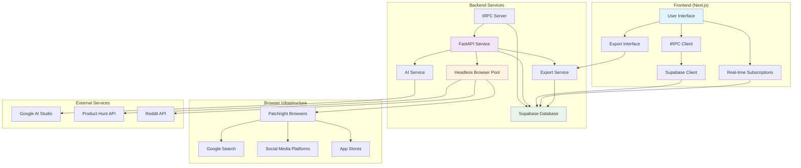

# Design Document - launch-lens AI Validation Platform

## Overview

launch-lens AI is architected as a modern full-stack SaaS idea validation platform using Next.js 14 with App Router for the frontend, Supabase for authentication and database, and FastAPI with Python for the scraping and AI analysis backend. The system follows a microservices approach where the frontend handles user interactions and data presentation, while the backend manages intensive scraping operations and AI processing asynchronously.

The platform combines automated headless browser scraping using Patchright from multiple distinct sources (Product Hunt, Reddit, Facebook, Twitter, Instagram, Google Search, Google Play Store, Apple App Store, Microsoft Store) with Google AI Studio's Gemini model to provide comprehensive validation reports. These reports include market opportunity analysis, competitive landscape assessment, user feedback sentiment analysis, and 8 specific strategic recommendations including MVP features, pricing strategies, and go-to-market approaches, all culminating in calculated market scores (1-10 scale).

The architecture prioritizes type safety through tRPC, real-time updates via Supabase subscriptions, scalable background processing for data collection and analysis, and data export capabilities in CSV and JSON formats. The design ensures data security through Row Level Security (RLS) policies, maintains separation of concerns between user-facing operations and data processing workflows, and provides responsive mobile-optimized user experiences with comprehensive error handling and recovery mechanisms.

## Architecture

### High-Level Architecture



### Data Flow

1. **User Authentication**: User creates account and authenticates via Supabase Auth
2. **Validation Creation**: User submits validation request (title and idea description) through Next.js frontend
3. **Request Processing**: tRPC server validates input constraints and creates validation record in Supabase with "processing" status
4. **Background Trigger**: tRPC server triggers FastAPI scraping service asynchronously
5. **Browser Pool Management**: FastAPI allocates headless browser instances from managed pool
6. **Data Collection**: FastAPI orchestrates parallel scraping using Patchright browsers with stealth measures and error handling
7. **Data Storage**: Scraped competitors and feedback stored in Supabase with proper data cleaning
8. **AI Analysis**: Gemini AI processes scraped data to generate comprehensive market analysis
9. **Market Scoring**: System calculates market score (1-10) based on competition and sentiment analysis
10. **Completion**: Validation status updated to "completed" with all analysis results
11. **Real-time Updates**: Frontend receives real-time updates via Supabase subscriptions
12. **Results Display**: User views comprehensive validation results through responsive interface
13. **Data Export**: User can export validation data in CSV or JSON format

## Components and Interfaces

### Backend Components (FastAPI)

#### Headless Browser Infrastructure
- **HeadlessBrowserService**: Manages Patchright browser pool with session lifecycle and resource cleanup
- **BrowserPool**: Maintains pool of browser instances for concurrent scraping operations
- **StealthManager**: Implements anti-detection measures including user agent rotation, human-like behavior simulation, and captcha handling
- **SessionManager**: Handles browser session management, cookie persistence, and proxy rotation

#### Scraping Architecture
- **ScrapingService**: Orchestrates parallel scraping from all sources with browser pool allocation and error handling
- **BaseScraper**: Abstract base class defining scraper interface with standardized headless browser methods
- **ProductHuntScraper**: 
  - Uses Product Hunt API for structured data extraction
  - Handles rate limiting and API authentication
  - Parses competitor information including users, revenue, and pricing models
- **Headless Browser Scrapers**: 
  - GoogleSearchScraper: Uses Patchright for stealth Google search with dynamic content handling and captcha detection
  - FacebookScraper: Scrapes public groups and pages using headless browser with social platform anti-bot evasion
  - TwitterScraper: Extracts tweets and sentiment analysis using browser automation with rate limiting
  - InstagramScraper: Hashtag and content analysis using headless browser with Instagram-specific stealth measures
  - GooglePlayStoreScraper: Android app data extraction using browser automation
  - AppStoreScraper: iOS app data extraction using browser automation  
  - MicrosoftStoreScraper: Windows app data extraction using browser automation
- **API-Based Scrapers**:
  - RedditScraper: Uses Reddit API (PRAW) for structured data access with fallback to browser scraping

#### AI and Analysis
- **AIService**: Integrates with Google AI Studio Gemini model for comprehensive analysis generation
- **AnalysisEngine**: Processes scraped data for market scoring and insight generation
- **SentimentAnalyzer**: Enhanced sentiment analysis with confidence scoring and context awareness

#### Data Management and Export
- **SupabaseService**: Database operations and validation status management
- **DataCleaner**: Deduplication and data quality processing with enhanced validation
- **ExportService**: Generates CSV and JSON exports with proper formatting and authentication
- **FileGenerator**: Creates downloadable files with structured data and metadata

### API Interfaces

#### FastAPI Endpoints
```python
# Scraping Operations
POST /api/process-validation    # Trigger validation processing
GET /health                     # Health check endpoint

# Export Operations
GET /api/export/csv/{validation_id}     # Generate CSV export
GET /api/export/json/{validation_id}    # Generate JSON export

# Background Tasks
process_validation()            # Async validation processing with browser pool
calculate_market_score()        # Market score calculation
cleanup_browser_sessions()      # Browser resource cleanup
```

#### tRPC Procedures
```typescript
// Authentication
auth.login()                    # User authentication
auth.signup()                   # User registration
auth.logout()                   # Session termination

// Validations
validations.create()            # Create new validation
validations.getAll()            # Get user's validations
validations.getById()           # Get specific validation
validations.updateStatus()      # Update validation status

// Export Operations
export.generateCSV()            # Trigger CSV export generation
export.generateJSON()           # Trigger JSON export generation
export.getExportStatus()        # Check export generation status
```

## Data Models

### Database Schema (Supabase/PostgreSQL)

#### Core Tables
```sql
-- User validations
validations {
  id: UUID (PK)
  user_id: UUID (FK to auth.users)
  title: TEXT (1-255 chars)
  idea_text: TEXT (10-1000 chars)
  status: TEXT ('processing'|'completed'|'failed')
  market_score: INTEGER (1-10)
  scraping_metadata: JSONB
  created_at: TIMESTAMP
  updated_at: TIMESTAMP
}

-- Competitor data
competitors {
  id: UUID (PK)
  validation_id: UUID (FK)
  name: TEXT
  description: TEXT
  website: TEXT
  estimated_users: INTEGER
  estimated_revenue: TEXT
  pricing_model: TEXT
  source: TEXT
  source_url: TEXT
  confidence_score: DECIMAL(3,2)
  scraping_method: TEXT ('api'|'browser')
  created_at: TIMESTAMP
}

-- User feedback and sentiment
feedback {
  id: UUID (PK)
  validation_id: UUID (FK)
  text: TEXT
  sentiment: TEXT ('positive'|'negative'|'neutral')
  sentiment_score: DECIMAL(3,2)
  source: TEXT
  source_url: TEXT
  author_info: JSONB
  scraping_method: TEXT ('api'|'browser')
  created_at: TIMESTAMP
}

-- AI-generated analysis
ai_analysis {
  id: UUID (PK)
  validation_id: UUID (FK)
  market_opportunity: TEXT
  competitive_analysis: TEXT
  strategic_recommendations: TEXT
  risk_assessment: TEXT
  gtm_strategy: TEXT
  feature_priorities: TEXT
  executive_summary: TEXT
  created_at: TIMESTAMP
}

-- Export tracking
exports {
  id: UUID (PK)
  validation_id: UUID (FK)
  user_id: UUID (FK)
  export_type: TEXT ('csv'|'json')
  file_path: TEXT
  status: TEXT ('generating'|'completed'|'failed')
  created_at: TIMESTAMP
}
```

### TypeScript Interfaces

#### Frontend Data Types
```typescript
interface Validation {
  id: string;
  userId: string;
  title: string;
  ideaText: string;
  status: 'processing' | 'completed' | 'failed';
  marketScore?: number;
  scrapingMetadata?: {
    sourcesScraped: string[];
    browserSessionsUsed: number;
    successRate: number;
    processingTime: number;
  };
  createdAt: string;
  updatedAt: string;
}

interface Competitor {
  id: string;
  validationId: string;
  name: string;
  description?: string;
  website?: string;
  estimatedUsers?: number;
  estimatedRevenue?: string;
  pricingModel?: string;
  source: string;
  sourceUrl?: string;
  confidenceScore: number;
  scrapingMethod: 'api' | 'browser';
  createdAt: string;
}

interface Feedback {
  id: string;
  validationId: string;
  text: string;
  sentiment: 'positive' | 'negative' | 'neutral';
  sentimentScore: number;
  source: string;
  sourceUrl?: string;
  authorInfo?: any;
  scrapingMethod: 'api' | 'browser';
  createdAt: string;
}

interface AIAnalysis {
  id: string;
  validationId: string;
  marketOpportunity: string;
  competitiveAnalysis: string;
  strategicRecommendations: string;
  riskAssessment: string;
  gtmStrategy: string;
  featurePriorities: string;
  executiveSummary: string;
  createdAt: string;
}

interface ExportData {
  id: string;
  validationId: string;
  userId: string;
  exportType: 'csv' | 'json';
  filePath: string;
  status: 'generating' | 'completed' | 'failed';
  createdAt: string;
}
```

## Headless Browser Infrastructure

### Browser Pool Management

#### Architecture Components
- **Browser Pool**: Maintains 3-5 concurrent Patchright browser instances for parallel scraping
- **Session Lifecycle**: Automatic browser instance rotation every 5-10 requests to avoid detection
- **Resource Management**: Memory monitoring and cleanup to prevent resource leaks
- **Proxy Integration**: Residential proxy rotation for improved success rates

#### Stealth Measures
- **Patchright Configuration**: Enhanced stealth plugin configuration to avoid detection signatures
- **Human Behavior Simulation**: Random delays (2-8 seconds), mouse movements, and scroll patterns
- **Fingerprint Randomization**: Dynamic viewport sizes, user agents, and browser settings
- **Captcha Handling**: Detection and logging of captcha challenges with graceful fallbacks

#### Performance Optimization
- **Intelligent Queuing**: Priority-based scraping queue with retry mechanisms
- **Success Rate Monitoring**: Track and adapt to platform-specific success rates
- **Fallback Strategies**: API-first approach with browser scraping as fallback when possible

### Design Rationale
The headless browser infrastructure provides reliable data extraction while maintaining stealth capabilities and respecting platform rate limits. The pool-based approach ensures efficient resource utilization while the stealth measures minimize detection risks.

## Error Handling

### Enhanced Error Management Strategy

The system implements multi-layered error handling with specific focus on browser automation challenges:

#### Frontend Error Handling
- **React Error Boundaries**: Catch component-level errors and display fallback UI
- **Form Validation**: Real-time validation with user-friendly error messages
- **Network Error Recovery**: Retry mechanisms for failed API calls with exponential backoff
- **Loading States**: Clear indicators during processing with timeout handling
- **User-Friendly Messages**: Clear error messages with recovery options for all failure scenarios
- **Graceful Degradation**: Maintain core functionality when non-critical services fail

#### Backend Error Handling
- **Browser Session Management**: Automatic recovery from browser crashes and timeouts
- **Scraper Resilience**: Individual scraper failures don't halt entire validation process
- **Captcha Detection**: Graceful handling of anti-bot challenges with logging
- **Rate Limiting**: Intelligent backoff strategies for platform-specific limits
- **Data Quality**: Enhanced validation and sanitization of browser-scraped data
- **Status Management**: Detailed validation status updates with error context

#### Design Rationale
This approach ensures the platform remains functional even when browser automation faces challenges, providing users with clear feedback and maintaining data integrity while maximizing scraping success rates.

## Security and Privacy

### Enhanced Data Protection Strategy

#### Authentication and Authorization
- **Supabase Auth**: Secure user authentication with session management
- **Row Level Security (RLS)**: Database-level access control ensuring users only see their data
- **Protected Routes**: Frontend route protection for authenticated users only
- **Export Authorization**: Secure file generation with user ownership validation

#### Data Security
- **Input Validation**: Strict validation of user inputs (title 1-255 chars, idea 10-1000 chars)
- **Data Sanitization**: Enhanced cleaning and validation of browser-scraped data
- **Secure API Communication**: HTTPS for all external API calls
- **Rate Limiting**: Prevent abuse through API endpoint rate limiting
- **File Security**: Temporary export file storage with automatic cleanup

#### Browser Security
- **Sandboxed Execution**: Isolated browser instances with restricted permissions
- **Proxy Security**: Secure proxy rotation with encrypted connections
- **Session Isolation**: No cross-validation data leakage between browser sessions

#### Design Rationale
Security is implemented at multiple layers including browser automation security to protect user data and ensure compliance with privacy standards while maintaining system performance.

## Performance and Scalability

### Enhanced Real-time Updates and Responsiveness

#### Real-time Architecture
- **Supabase Subscriptions**: Real-time validation status updates without polling
- **Optimistic Updates**: Immediate UI feedback for better user experience
- **Background Processing**: Asynchronous scraping with browser pool management prevents UI blocking
- **Progress Tracking**: Granular progress updates during multi-source scraping with estimated completion time calculation
- **Status Broadcasting**: Real-time status updates including current scraping phase and completion percentage

#### Browser Performance Optimization
- **Resource Monitoring**: Memory and CPU usage tracking for browser instances
- **Intelligent Scaling**: Dynamic browser pool sizing based on demand
- **Cache Management**: Browser cache optimization for improved performance
- **Concurrent Processing**: Parallel scraping with managed resource allocation

#### Mobile Optimization
- **Responsive Design**: Tailwind CSS for mobile-first responsive layouts
- **Touch-friendly UI**: Optimized interactions for mobile devices
- **Performance Budgets**: 3-second load time targets for cached content
- **Export Optimization**: Mobile-friendly export interfaces

#### Design Rationale
The enhanced real-time architecture with browser pool management ensures users receive immediate feedback on validation progress while maintaining optimal resource utilization and consistent experience across devices.

## Data Export System

### Comprehensive Export Functionality

#### Export Architecture
- **Export Service**: Dedicated service for generating CSV and JSON exports with proper authentication
- **File Generation**: Structured data formatting with validation metadata and timestamps
- **Download Management**: Secure file serving with automatic cleanup
- **Format Optimization**: Platform-specific formatting for CSV compatibility and JSON structure

#### Export Data Structure
- **CSV Format**: Competitor data with headers: Name, Description, Website, Estimated Users, Revenue, Pricing Model, Source, Confidence Score, Date Added
- **JSON Format**: Complete validation data including competitors, feedback, AI analysis, and processing metadata
- **Metadata Inclusion**: Export timestamp, validation details, and data source attribution
- **File Naming**: Descriptive filenames including validation title and export date for easy identification

#### Security and Performance
- **Access Control**: User-specific export generation with ownership validation
- **File Security**: Temporary storage with automatic cleanup after download
- **Rate Limiting**: Export generation limits to prevent abuse
- **Progress Tracking**: Real-time export generation status updates

#### Design Rationale
The export system provides users with portable data formats for external analysis while maintaining security and performance standards.

## AI Analysis Integration

### Enhanced Market Intelligence

#### AI Processing Pipeline
- **Data Aggregation**: Combine scraped data from all sources including browser automation results
- **Market Scoring**: Calculate 1-10 market score based on competition density, sentiment, and data quality
- **Strategic Insights**: Generate 8 specific recommendations including MVP features, pricing, and GTM strategy
- **Quality Assessment**: Enhanced analysis based on scraping method and confidence scores

#### Analysis Components
- **Market Opportunity**: Assess market size and potential based on enhanced competitor analysis
- **Competitive Landscape**: Detailed competitor analysis with browser-extracted positioning insights and specific competitive insights
- **Strategic Recommendations**: Generate exactly 8 specific strategic recommendations covering MVP features, pricing strategies, go-to-market approaches, and business model optimization
- **Risk Assessment**: Identify potential challenges and mitigation strategies including data reliability considerations
- **GTM Strategy**: Comprehensive go-to-market strategy recommendations based on competitive analysis
- **Feature Prioritization**: Recommend MVP features based on comprehensive market gaps analysis and user feedback sentiment
- **Executive Summary**: Consolidated overview combining all analysis components with key insights and market score rationale

#### Design Rationale
The enhanced AI integration transforms browser-scraped data into actionable business insights, providing entrepreneurs with comprehensive market intelligence while accounting for data quality and source reliability.

## Dashboard and Validation Management

### Enhanced User Dashboard Design

#### Dashboard Components
- **ValidationList**: Displays all user validations with scraping method indicators and processing details
- **ValidationCard**: Shows title, status, market score, data sources, and creation date
- **Progress Indicators**: Real-time status updates with browser automation progress and estimated completion time
- **Export Interface**: Integrated CSV and JSON export functionality with download management
- **Empty State**: Call-to-action for users with no validations to create their first validation

#### Validation Results Interface
- **Executive Summary**: Prominently displays AI-generated summary, market score, and data quality indicators
- **Competitor Table**: Enhanced sortable display with scraping method, confidence scores, and export options
- **Sentiment Analysis**: Visual representation of feedback with source attribution and reliability indicators
- **AI Analysis Sections**: Organized presentation with enhanced insights based on comprehensive data collection
- **Export Controls**: Integrated CSV and JSON export buttons with progress indicators

#### Design Rationale
The enhanced dashboard provides comprehensive validation management with data export capabilities while presenting complex browser-scraped data in an accessible, actionable format that supports informed decision-making.

## Testing Strategy

### Enhanced Testing Approach

#### Frontend Testing
- **Unit Tests**: Component testing with Jest and React Testing Library including export functionality
- **Integration Tests**: tRPC client-server communication testing with export endpoints
- **E2E Tests**: Critical user flows using Playwright including export workflows
- **Responsive Testing**: Cross-device and cross-browser compatibility with export interfaces

#### Backend Testing
- **Unit Tests**: Individual scraper and service function testing with browser automation mocking
- **Integration Tests**: FastAPI endpoint testing including export endpoints with test client
- **Browser Automation Testing**: Patchright browser testing with mock websites and anti-bot scenarios
- **Load Testing**: Concurrent scraping performance validation with browser pool management
- **Export Testing**: File generation and download functionality testing

#### Design Rationale
The enhanced testing strategy ensures reliability across all system components including browser automation and export functionality while maintaining development velocity through comprehensive automated testing pipelines.